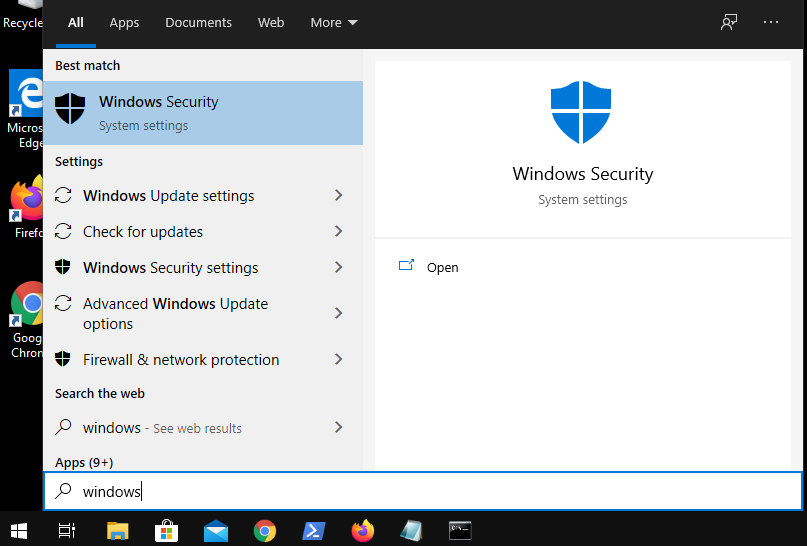
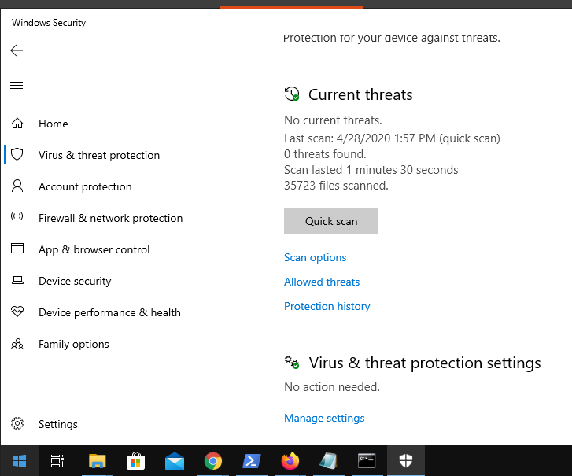
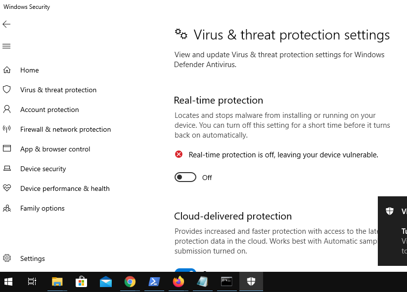
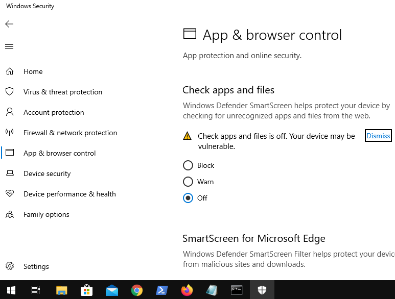

# Office Autoinstall & Hack Explained

Este repositorio pretende mostrar la forma en que funciona la instalación automática de office y su posterior activación. 

+ Este script permite instalar de forma automática:
	+ `Office 2016 Pro Plus x64`
	+ `Office 2016 Pro Plus x32`
	+ `Office 365 Pro Plus x64`
	+ `Office 365 Pro Plus x32`
	+ Otras versiones de office (P. Ej. Enterprise)
	+ Todo en cualquier lenguaje
+ Se adjunta un script con el que podemos observar que es posible realizar una activación del producto.
	+ **ADVERTENCIA**
		+ Este material es meramente educativo y no se incentiva de ninguna manera a el uso de la pirateria.
		+ Como alternativa recomendamos:
			+ La compra de licencias originales
			+ Obtener licencias gratuitas para estudiantes
			+ Usar software libre

# Instalación Automatizada de Office

##### * (Si usted únicamente quiere realizar la instalación salte hasta el punto *"3) ¿Cómo comenzar la instalación automatizada?"*)

La mayor parte de las aplicaciones instalables en windows se pueden configurar a través de archivos `.xml`. Por lo anterior, es posible correr el archivo de instalación de office `setup.exe` y darle como parámetro el `archivo_de_configuracion.xml` para lograr una instalación automatizada.

## Contenido de la carpeta deploy_office

Todo lo necesario para lanzar la instalación de office de una manera automatizada, se encuentra dentro de la carpeta `deploy_office`. 

Dentro de ella los siguientes archivos:
+ `config_sample.xml` (Archivo ejemplo de configuración)
+ `EULA`  (Los términos de licencia)
+ `setup.exe` Exe que se encarga de realizar la instalación. (Office Deployment Tool)
+ `configuration_*.xml` (Archivos de configuracion de cada version en especifico)
	+ Office365_x64
	+ Office365_x86
	+ Office Enterprise
	+ Office 2016 Pro Plus
+ `install_config.cmd` (Archivo que lanza la instalación)
	+ Office365_x64
	+ Office365_x86
	+ Office Enterprise
	+ Office 2016 Pro Plus

## 1) ¿Cómo se configura el archivo .xml?
Nosotros ya contamos diversos archivos de configuración `.xml` por defecto. Sin embargo, estos pueden ser modificados para que se acoplen completamente a nuestras necesidades. Para ello a continuación explicaremos las partes del archivo `config_sample.xml`

```xml
<Configuration>

  <Add OfficeClientEdition="64" Channel="Monthly">
    <Product ID="O365ProPlusRetail">
      <Language ID="es-es" />
      <ExcludeApp ID="Access" />
      <ExcludeApp ID="InfoPath" />
      <ExcludeApp ID="Lync" />
      <ExcludeApp ID="SharePointDesigner" />
      <ExcludeApp ID="Visio" />
      <ExcludeApp ID="Skype" />
      <ExcludeApp ID="Skypeforbusiness" />
      <ExcludeApp ID="Groove" />
    </Product>
    <Product ID="VisioProRetail">
      <Language ID="es-es" />
    </Product>
  </Add>
</Configuration>
```

Como podemos observar el archivo de configuración únicamente consta de un par de etiquetas en las que destacan:
+ Add OfficeClientEdition
	+ Aquí podemos elegir los valores `32` o `64` dependiendo si queremos hacer la instalación de 32bits o 64bits
+ Product ID
	+ Aquí podemos seleccionar el producto a instalar
		+ `O365ProPlusRetail` (Office 365 ProPlus)
		+ `ProPlusRetail` (Office 2016 ProPlus)
	+ Language ID
		+ `en-us`
		+ `es-es`
		+ <a href="https://docs.microsoft.com/en-us/deployoffice/overview-deploying-languages-microsoft-365-apps" target=_blank>Puede ver todos los códigos de lenguajes aquí</a>
	+ ExcludeApp ID
		+ Aplicaciones a excluir. No serán instaladas
	+ Product ID
		+ Aplicaciones extras que se incluirán

## 2) ¿Cómo se configura el archivo .cmd?
Ya que nuestro `setup.exe` depende de un archivo de configuración, este debe correrse a través de la consola, ya sea mediante `cmd` ó `powershell`.
Para facilitar esto nosotros podemos crear un archivo `install_config.cmd`.
* Nuevamente, nosotros ya tenemos un par de archivos preconfigurados
	+ 

¿Qué hay dentro de este archivo?

```bat
@echo off
cd /d %~dp0
setup.exe /configure config_sample.xml
pause
```

Básicamente este pequeño script lo que realiza es: 
1. Llamar a `setup.exe` 
2. Dar la bandera `/configure` que indica que le darás un archivo de configuración 
3. Indicar el nombre del archivo de configuración `install_config.cmd`

Si lo queremos modificar solamente cambiamos el punto *"número 3"* especificando el nombre del archivo de configuración que se tendrá.
* Si creamos un archivo desde cero, hay que recordar guardarlo con extensión *.bat* o *.cmd*

## 3) ¿Cómo comenzar la instalación automatizada?

Para comenzar una instalación automatizada únicamente debemos dirigirnos hacia la carpeta `deploy_office` y hacer doble click en el `install_config.cmd` deseado.
+ Como vimos anteriormente contamos con distintas configuraciones dependiendo de nuestras necesidades
	+ Office365_x64
	+ Office365_x64
	+ Una customizada, en caso de que la haya creado
+ Si tiene algún problema durante este proceso consulte la sección de "Problemas / Soluciones"

Una vez ejecutado nuestro `install` aparecerá la tipica pantalla de instalación de Office y tras varios minutos se habrá completado la instalación. El tiempo que tarde dependerá principalmente de su velocidad de descarga de internet. 

Una vez que eso haya finalizado tendremos disponible nuestro Office sin licencia.

# ¿Validación de licencia? ¿Crack de Office?

Es posible validar la licencia mediante un simple script. 

## Password
`activate`

# Problemas / Soluciones
+ Windows detecta activate como virus
	+ Lo que sucede es que windows detecta el script como un activador de Office y por supuesto lo bloquea. De hecho, en la descripción de Windows Defender menciona.
		+ HackTool:BAT/AutoKMS
		+ This program has potentially unwanted behavior
	+ Y claro, ellos no desean que tú tengas sus productos sin pagar por ellos
	+ Basta con deshabilitar Windows Defender durante la activación.
	+ Si el problema persiste desactiva tu antivirus 
+ Pantalla azul de bloqueo
	+ Al igual que `Windows Defender - Real Time Protection` es necesario desactivar `App & Browser Control - Check apps and files` como se menciona en la sección de `¿Cómo apagar Windows Defender?`
+ ¡No sé la contraseña del zip!
	+ Bro, ese no es un problema. La contraseña es `activate` como se mencionó en el post.

# Referencias / Agradecimientos

+ <a href="http://MSGuides.com" target=_blank>MSGuides</a>
+ <a href="http://aka.ms/ODT" target=_blank>Office Deployment Tool</a>
+ <a href="https://docs.microsoft.com/en-us/deployoffice/office-deployment-tool-configuration-options" target=_blank>Office Deployment Tool configuration options</a>
+ <a href="https://docs.microsoft.com/en-us/deployoffice/overview-deploying-languages-microsoft-365-apps" target=_blank>Languages ID Office</a>
+ <a href="https://docs.microsoft.com/en-us/office365/troubleshoot/installation/product-ids-supported-office-deployment-click-to-run" target=_blank>List of Product IDs which are supported by the Office Deployment Tool for Click-to-Run</a>

# ¿Cómo apagar Windows Defender?

## 1) Abrimos Windows Security 


## 2) Dentro del menú Virus & Threat Protection seleccionamos *"Manage settings"*


## 3) Nos aseguramos de dejarlo en modo apagado/off


## 3) Dentro de App & browser control seleccionamos *"Off"* para "Check apps and files" 


## 5) Listo. Podemos realizar la prueba del script para ver que efectivamente funciona.

## 6) Luego de que hayas comprobado el funcionamiento, ¡Activa Windows Defender nuevamente!